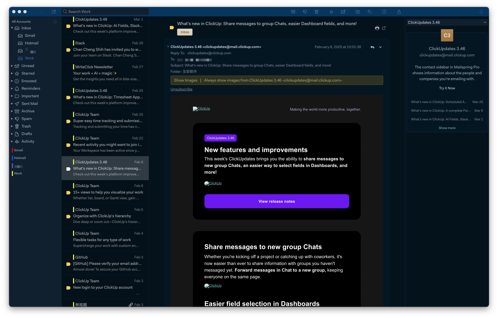

# Mailspring Night Owl Theme

A dark, calm, high-contrast theme for [Mailspring](https://getmailspring.com), inspired by the popular [Night Owl](https://github.com/sdras/night-owl-vscode-theme) color palette.

Ideal for late-night email writing, low-light environments, and anyone who loves cool, deep hues.

## ✨ Features

- Inspired by VS Code's Night Owl Theme
- Carefully tuned background, sidebar, and highlight colors
- Consistent contrast and readable typography
- Fully compatible with Mailspring's theme engine

## 📸 Preview



## 📦 Installation

### Option 1: Manual Install

1. Download this theme as a `.zip` file and unzip it.
2. Open Mailspring and go to `Preferences > Appearance`.
3. Click `Install New Theme...` and select the unzipped folder.
4. Select `Night Owl` from the theme list. Done!

### Option 2: GitHub Clone

```bash
git clone git@github.com:graysurf/mailspring-night-owl.git ~/.config/Mailspring/packages/mailspring-night-owl
```

Then restart Mailspring and choose the theme from `Preferences > Appearance`.

## 🛠 Development Notes

This theme customizes:

- `styles/ui-variables.less`
- `styles/index.less`
- `styles/email-frame.less`
- Uses modern CSS filters and LESS variables

## 🪪 License

[](LICENSE)

This project is licensed under the MIT License. See [LICENSE](LICENSE).
